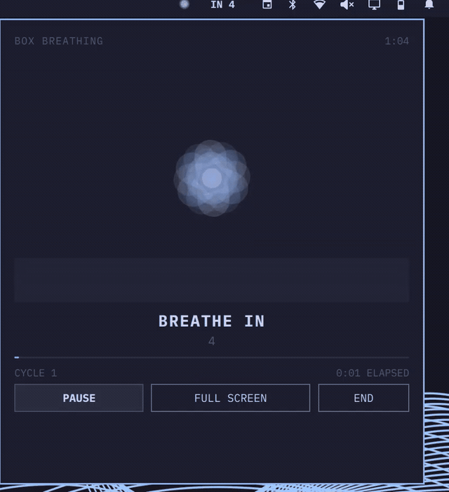

# Kalm for Omarchy

Kalm brings a familiar guided-breathing experience, similar in purpose to Apple Breathe and Mindfulness, directly to the Omarchy bar. Pick a technique, choose a duration, and follow a procedural bloom that opens as you breathe in and closes as you breathe out.

The plugin runs entirely inside Omarchy's existing Quickshell process. It needs no account, network access, elevated privileges, or additional runtime packages.

> [!NOTE]
> Kalm for Omarchy is a separate, original project from the KDE Kalm application. It does not install or require Arch's `kalm` package.

## Demo



[Watch the full walkthrough](demo.mp4) to see session setup, the countdown, full-screen mode, and live Omarchy theme changes.

## Features

- Original layered bloom animation colored by the active Omarchy theme.
- Seven guided breathing techniques with precise phase timing.
- One, three, and five minute sessions that finish on a complete breath cycle.
- Shared session state across monitors.
- Sessions continue when the panel is closed and return when it is reopened.
- Pause, resume, early end, progress, and completion views.
- Full-screen breathing view with the same live session controls.
- Horizontal and vertical bar layouts.
- Reduced-motion mode.
- Mouse and keyboard navigation.

## Install

### Requirements

- Omarchy 4.x (Quattro). Kalm is tested with Omarchy 4.0.0.
- No additional packages or setup steps.

Install and enable Kalm with one command:

```bash
omarchy plugin add https://github.com/ctl0v0/kalm-omarchy-plugin.git --enable
```

The bloom appears in the right section of the bar with Box Breathing and a one-minute session selected by default. Move it at any time:

```bash
omarchy bar move io.github.ctl0v0.kalm --section right
```

## Use

No configuration is required. Click the bloom in the bar, choose a technique and duration, then select **Begin**. While a session is running, the bar shows the current phase and its remaining seconds. Select **Full Screen** for a distraction-free breathing view.

Closing the panel does not stop the session. Click the bar widget again to return to it.

Inside the panel:

| Input | Action |
|---|---|
| Arrow keys or Tab | Move between controls |
| Enter or Space | Activate the selected control |
| `S` | Start from the setup view |
| `P` | Pause or resume |
| `F` | Enter or exit full screen |
| `E` | End the active session |
| Escape | Exit full screen, or close the panel without ending the session |

Kalm can also be controlled from scripts or keybindings:

```bash
omarchy-shell io.github.ctl0v0.kalm start
omarchy-shell io.github.ctl0v0.kalm pause
omarchy-shell io.github.ctl0v0.kalm resume
omarchy-shell io.github.ctl0v0.kalm stop
omarchy-shell io.github.ctl0v0.kalm status
```

## Techniques

| Technique | Cadence |
|---|---|
| Box Breathing | In 4, hold 4, out 4, hold 4 |
| Resonant Breathing | In 5.5, out 5.5 |
| 4-7-8 Breathing | In 4, hold 7, out 8 |
| Box Breathing for Sleep | In 4, hold 4, out 6, hold 2 |
| Coordinated Breathing | In 4, counted out 20 |
| Nadi Shodhana | Alternate left and right in a 4-4-4-4 cadence |
| Yogic Breathing | Guide one breath through belly, mid-torso, and upper chest |

> [!CAUTION]
> Breathe comfortably and do not strain to match a cadence. Stop if you feel dizzy, short of breath, or uncomfortable, and do not use Kalm during activities that require your full attention. Kalm provides timing cues only and is not medical advice.

## Settings

The setup view offers one, three, and five-minute sessions. To change the defaults stored in Omarchy's bar configuration, use:

```bash
omarchy bar set io.github.ctl0v0.kalm defaultTechnique "Resonant Breathing"
omarchy bar set io.github.ctl0v0.kalm defaultDurationMinutes 3 --json
omarchy bar set io.github.ctl0v0.kalm reducedMotion true --json
```

The configured duration accepts any whole number from one through five minutes. Sessions finish at the end of a complete breath cycle, so the actual end time can be slightly later. Selections made in Kalm's setup view apply to that session and do not rewrite user configuration.

## Update

```bash
omarchy plugin update io.github.ctl0v0.kalm
```

## Remove

```bash
omarchy plugin remove io.github.ctl0v0.kalm
```

Kalm creates no services, packages, user data, or configuration outside Omarchy's own plugin entry, so removal leaves no additional files behind.

## Troubleshooting

If Kalm does not appear after installation, rescan the plugin directory:

```bash
omarchy-shell shell rescanPlugins
```

If edited plugin code does not hot-reload, restart the shell:

```bash
omarchy restart shell
```

Use `omarchy plugin list` to confirm that `io.github.ctl0v0.kalm` is discovered and enabled.

## Development

Validate and test the repository with:

```bash
./tests/static.sh
```

The script runs Omarchy manifest validation, `qmllint`, and the offscreen Qt Quick test suite. The pure timing tests cover phase boundaries, all cycle lengths, alternate nostrils, Yogic stages, counted breathing, easing, and cycle-aligned completion.

Development requires `omarchy`, `jq`, Qt's `qmllint`, and `qmltestrunner`. The test script supports `OMARCHY_PATH`, `QMLLINT`, and `QMLTESTRUNNER` overrides.

## Attribution

The factual technique set and timings were informed by [KDE Kalm](https://apps.kde.org/kalm/). The grow-on-inhale and shrink-on-exhale interaction principle was informed by breathing interfaces such as Apple Watch Mindfulness.

This plugin is an original implementation and contains no KDE Kalm or Apple code, icons, artwork, or other assets. It is an independent project and is not affiliated with, sponsored by, or endorsed by KDE, Apple, Omarchy, or 37signals.

## License

[MIT](LICENSE)
